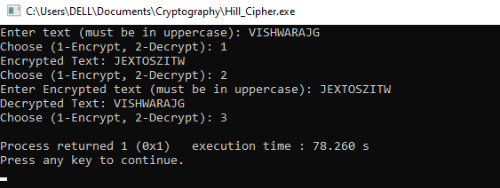

# Cryptography---19CS415-classical-techqniques
# Ex-3 Hill Cipher
Hill Cipher using with different key values

## AIM:

To develop a simple C program to implement Hill Cipher.

## DESIGN STEPS:

### Step 1:

* Design of Hill Cipher algorithnm 

### Step 2:

* Implementation using C or pyhton code

### Step 3:

* Testing algorithm with different key values. 
## ALGORITHM DESCRIPTION:
The Hill cipher is a substitution cipher invented by Lester S. Hill in 1929. Each letter is represented by a number modulo 26. To encrypt a message, each block of n letters is multiplied by an invertible n × n matrix, again modulus 26.
To decrypt the message, each block is multiplied by the inverse of the matrix used for encryption. The matrix used for encryption is the cipher key, and it should be chosen randomly from the set of invertible n × n matrices (modulo 26).
The cipher can, be adapted to an alphabet with any number of letters. All arithmetic just needs to be done modulo the number of letters instead of modulo 26.


## PROGRAM:
```
#include <stdio.h>
#include <string.h>
#include <stdlib.h>

#define SIZE 2

int modInverse(int a) {
    for (int x = 1; x < 26; x++)
        if ((a * x) % 26 == 1)
            return x;
    return -1;
}

void multiplyMatrix(int matrix[SIZE][SIZE], int text[SIZE], int result[SIZE]) {
    for (int i = 0; i < SIZE; i++) {
        result[i] = 0;
        for (int j = 0; j < SIZE; j++) {
            result[i] += matrix[i][j] * text[j];
        }
        result[i] = (result[i] % 26 + 26) % 26; 
    }
}

void hillCipherEncrypt(char* text, int keyMatrix[SIZE][SIZE]) {
    int textVec[SIZE], cipherVec[SIZE];

    printf("Encrypted Text: ");
    for (int i = 0; i < strlen(text); i += 2) {
        textVec[0] = text[i] - 'A';
        textVec[1] = text[i + 1] - 'A';

        multiplyMatrix(keyMatrix, textVec, cipherVec);

        printf("%c%c", cipherVec[0] + 'A', cipherVec[1] + 'A');
    }
    printf("\n");
}

// Function to decrypt the text using Hill Cipher
void hillCipherDecrypt(char* text, int keyMatrix[SIZE][SIZE]) {
    int det = keyMatrix[0][0] * keyMatrix[1][1] - keyMatrix[0][1] * keyMatrix[1][0];
    int invDet = modInverse((det % 26 + 26) % 26);
    if (invDet == -1) {
        printf("Matrix is not invertible\n");
        return;
    }

    int invKeyMatrix[SIZE][SIZE] = {
        {(keyMatrix[1][1] * invDet) % 26, (-keyMatrix[0][1] * invDet) % 26},
        {(-keyMatrix[1][0] * invDet) % 26, (keyMatrix[0][0] * invDet) % 26}
    };

    for (int i = 0; i < SIZE; i++)
        for (int j = 0; j < SIZE; j++)
            invKeyMatrix[i][j] = (invKeyMatrix[i][j] + 26) % 26;

    int textVec[SIZE], plainVec[SIZE];

    printf("Decrypted Text: ");
    for (int i = 0; i < strlen(text); i += 2) {
        textVec[0] = text[i] - 'A';
        textVec[1] = text[i + 1] - 'A';

        multiplyMatrix(invKeyMatrix, textVec, plainVec);

        printf("%c%c", plainVec[0] + 'A', plainVec[1] + 'A');
    }
    printf("\n");
}
void padText(char *text) {
    if (strlen(text) % 2 != 0) {
        strcat(text, "X");
    }
}

int main() {
    char text[100];
    int keyMatrix[SIZE][SIZE] = {{3, 3}, {2, 5}};
    int choice;

    printf("Enter text (must be in uppercase): ");
    fgets(text, sizeof(text), stdin);
    text[strcspn(text, "\n")] = 0;

    padText(text);

    while (1) {
        printf("Choose (1-Encrypt, 2-Decrypt): ");
        scanf("%d", &choice);
        getchar();
        switch (choice) {
            case 1:
                hillCipherEncrypt(text, keyMatrix);
                break;
            case 2:
                printf("Enter Encrypted text (must be in uppercase): ");
                fgets(text, sizeof(text), stdin);
                text[strcspn(text, "\n")] = 0;
                hillCipherDecrypt(text, keyMatrix);
                break;
            default:
                exit(1);
        }
    }
    return 0;
}
```
## OUTPUT:

## RESULT:
The program is executed successfully
